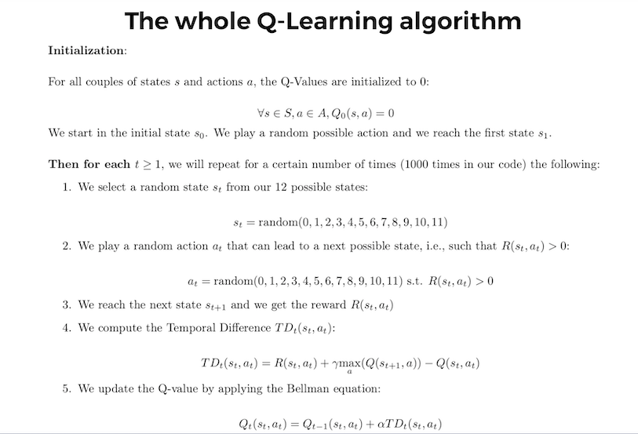

# Optimizing-Warehouse-Flows-with-Q-Learning

<b>BUSINESS CASE </b>  

The Warehouse belongs to an online retail company that fills products to its customers and inside these warehouse the products are a stored in twelve different locations twelve different locations from A to L. Each of these letters here are one specific location where the products are stored and of course there are grouped by similar product categories. The priority is given based on some sensitive and high value products.
 

The structure of the warehouse.

 

The company has the orders placed by online customers and we have an warehouse robot to collect products from these twelve different locations in the warehouse. It is connected to two systems, the first system is not an AI but is used to produce real time ranking of the warehouse areas based on the customer orders. Here we take an instance of the priority ranking as shown below.
  

 

The second system which is of course an AI is used to figure out the shortest route to go to locations. The robot has to go by an intermediate area before it reaches the desired location. This model looks very simple but is really powerful and useful as the complexities on the structure of the warehouse increases.
  

<b>Q-LEARNING ALGORITHM </b>

Q-learning is an off policy reinforcement learning algorithm that seeks to find the best action to take given the current state. It’s considered off-policy because the q-learning function learns from actions that are outside the current policy, like taking random actions, and therefore a policy isn’t needed. More specifically, q-learning seeks to learn a policy that maximizes the total reward.
 

